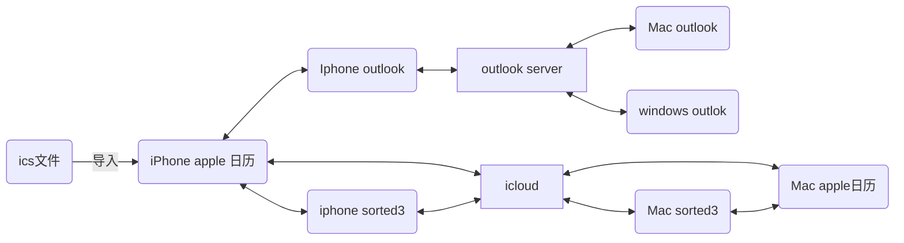

本来是 apple 全家桶，无奈 AWS 上的 MacOS 没办法用，于是在 windows 端使用 outlook 对 apple 的日历进行接入。

首先在 apple 日历部分添加 outlook 账户，这样就可以配置完 apple 日历和 outlook 的双向同步，在 MacOS/IOS 上安装 outlook 客户端，然后 windows 只需要使用默认的邮件客户端即可。

<!--more-->

从下图可以看到日历分为 outlook 和 icloud 的部分，我们把后续的日程添加到 Outlook 部分就好。另外注意的是，outlook 的默认日历就叫做“日历”，不能修改名字也不能删除。

同时我也在 apple 上安装了 sorted3，只有日程会被上边的流程同步，任务只能用软件自带的 icloud 同步（apple 设备），这样就满足了在 window 和 apple 随时查看和编辑的功能了，sorted3 中也可以选择需要同步的日历。

对于批量的日程，那么需要用到 ICS 文件，实测 iphone 的微信不能唤起 apple 的日历，所以采取了发邮件的办法，这里用到的是 apple 的邮件客户端，倒入 outlook 会有些许同步的问题，就不再继续研究了。手机的 Apple 日历倒入之后，全平台很快就可以进行同步了。

这样无论是 apple 日历，outlook 还是 sorted3，只要一个软件添加日程，剩下的平台都会同步。

